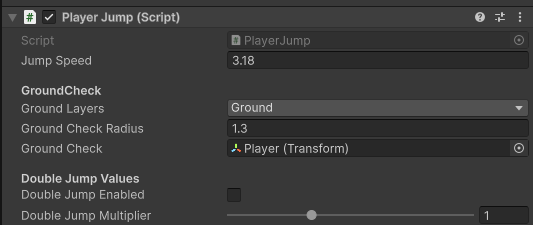

# PlayerJump Class

Class that controls the player jump

## Events 

#### `OnPlayerJump()`
Triggers when the player does a normal jump.
#### `OnPlayerDoubleJump()`
Triggers when the player does a double jump. Only triggers when the `doubleJumpEnabled` bool is set to true (ticked in the editor).
#### `OnPlayerLand()`
Triggers when the player lands from any fall.
#### `OnPLayerReleaseJump`
Triggers when the player releases the jump button and cuts their fall short.
#### `OnPlayerLeavesGround()`
Triggers when the player has left the ground. Either from pressing the jump button or falling from a high place.

## Accessible Variables (In Code)

#### `public bool isGrounded`
Whether or not the player is in the air. Cannot be changed by other classes. If the player isGrounded then they can jump

#### `public bool isDashing`
Changes to true when the player isDashing or false. Not recommend to touch this yourself, may be removed in the future.

#### `public void EnableDoubleJump(bool enable)`
Enables or disables the player's double jump. Used in the doubleJumpItem script.

## Accessible Variables (In Unity Editor)

#### `float jumpSpeed`
Adjusts both the max height they can jump and changes the speed at which they go up.

### GroundCheck values

#### `LayerMask groundLayers`
List of the layers in your game that are defined as ground layers. If it says Nothing you should create and pick a layer like "Ground" and apply that layer to your floor objects.

#### `float groundCheckRadius`
How big the ground detection radius. When a grounded object colides with this radius the game will assume that the player isGrounded and therefore be able to jump. Recommended that this value is very small.

#### `Transform groundCheck`
The gameobject where the groundcheck radius will start from. By default it is set to the player. 

### Double Jump Values
#### `bool doubleJumpEnabled` 
Whether or not the double jump ablity is enabled on the start of the game

#### `float doubleJumpMultiplier`
How much higher/lower the player can jump compared to the normal jump. Default value is 1 meaning the amount of jump the player gets doesn't change with a double jump.

