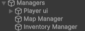
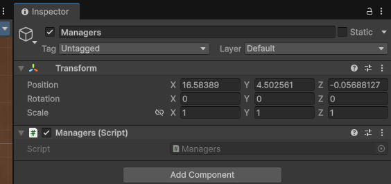

# Managers class
Allows for the rest of your managers to continue existing when you load into a new room.
This should be part of your main managers object with the rest of your managers included as children

## Events 

#### `onGameStarted()`

Triggers when the game starts.

#### `onFastTravelSystemLoaded()`
Triggers when the FastTravelSystem has sucessfully loaded.

#### `onGameReady()`
Triggers when the game is ready to be played.