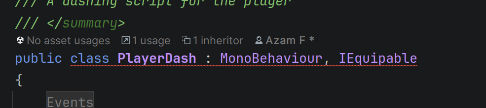

# How to create your own Inventory item with Vaniakit 
With Vaniakit you can use scriptable objects to add your own weapon, ablity, currency, etc.

## Create your item

Right click on your project tab and create your item by going to Create/Vaniakit/Item. Next name your item
## Create your item script

### Ignore this part if you're testing VaniaKit as a participant of the research project. This section has already been done for you. Move on to [this](createItem.md/#set-your-values-for-your-item-object)
Create a monobehaviour script and add the `IEquipable` interface to it 

Fix the errors by adding the `Equip()` and `Unequip()` methods into your script

**Hint!** You can use the lightbulb in Rider and Visual studio on the far left to add it yourself if you have your cursor selected on the interface.

Add code that makes your player equip the item button when it's toggled. **Example of how that looks for the player dash** 

Now you adding code to you item to make it yours.
## Create an empty game object 
### Ignore this part if you're testing VaniaKit as a participant of the research project. This section has already been done for you. Move on to [this](createItem.md/#set-your-values-for-your-item-object)

Create an empty game object in the scene view and add your item script to it 

### Make it a prefab
Drag your game object into the project view and make it a prefab

We'll add it to the Item object we made previously
## Set your values for your Item object

Set your item's 

- Name 
- Description
- Category (aka what is your item)
-  Whether it can be stacked (can the player hold multiple of this item) 
- Add your prefab that we just made to the `Action Script` slot. **You can find this object inside the Scenario 1 folder for the sword**

You've now made your own item that you can add to your Inventory!

