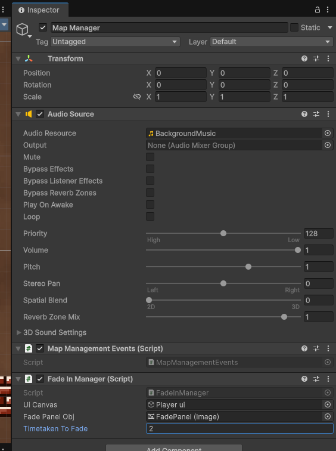

#FadeInManager Class

Controls the fade in and out of the view. Required for loading other scenes in your game.

## How to use
Place your Player Ui in `uiCanvas` box 

**Note** that your Player UI should also be stored as a child of the main managers game object. See **[here](Managers.md)**

Add your own image component from the player ui (optional Vaniakit will create one if one is not defined).
This controls the fade in and fade out of the view when the player goes to another room

Finally decide how long it should take to fade the screen to black and fade out from black in seconds.

Your map management system is now working!

