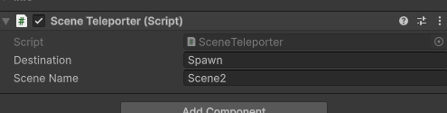

# Scene Teleporter class

Script that allows you to teleport to different room.

## Events 
#### `onPlayerLoadedHere()`
Triggers if the player has loaded in the specific point that this script is attached to.
## How to use
**Note:** Before you follow this tutorial make sure you've set up the [Managers](Managers.md) class and the [FadeInManager](fadeInManager.md) which should be a child in the managers class. 

##### Make sure your box colider is big enough and Is trigger is enabled

#### Move the gameobject to a place where you want them to be teleported.

#### Adjust the script Teleporter values accordingly. 
**Note:** The object that you want the player to teleport to also has to include the SceneTeleporter Script.

Take this diagram for example if you want to go from Scene1 to Scene2 then `sceneName` would be `Scene2`.

If you then want to teleport over the gameobject called `Spawn` then `Destination` would be `Spawn`

The arrow in the picture shows that the player would end up at that exact point when they trigger the scene teleporter after walking up to it with these values.

If you've done everything correctly the player will now teleport from point a to point b